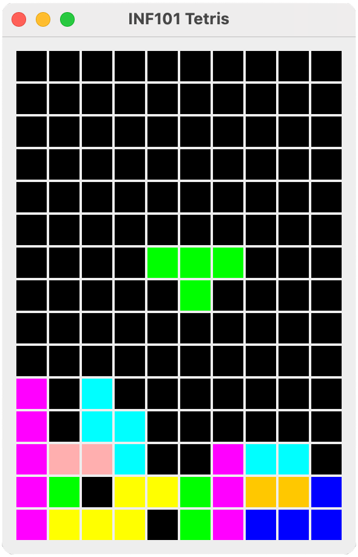

# **⚠️ IKKE FORK DETTE REPOET**  
Hvis du forker dette repoet selv, vil du miste **15 poeng** fra din opprinnelige score.  

# **🕹️ Tetris**
Surprise surprise, semesteroppgaven er å lage Tetris :)

I denne oppgaven skal du lage en enkel versjon av det klassiske spillet **Tetris** fra bunnen av, ved hjelp av **Swing**-rammeverket i Java.  

Dersom du ikke har spilt Tetris før, anbefaler vi at du prøver det gratis på den offisielle nettsiden:  
🎮 [Spill Tetris her](https://tetris.com/play-tetris)  

For å sikre at du får en god læringsopplevelse og at vi kan hjelpe deg underveis, er det viktig at du **følger denne guiden nøye**.  

---

## **🎯 Læringsmål**  
✅ Forstå og bruke **Model-View-Controller**-designmønsteret  
✅ Styrke dine ferdigheter i **Java og objektorientert programmering**  
✅ Bruke kunnskapen du har lært tidligere i kurset i et større prosjekt  

---

## **📌 Steg-for-steg guide**  

Vi bygger spillet gradvis. Følg disse stegene i rekkefølge:  

1. [🛠️ Planlegg arkitekturen](./guide/00-arkitektur.md)  
2. [📏 Koble sammen Grid og View](./guide/01-drawTetris.md)  
3. [🧮 Test brettet](./guide/02-testBoard.md)  
4. [⬇️ Tegn en fallende brikke](./guide/03-tegnbrikke.md)  
5. [➡️ Flytt brikken](./guide/04-flyttebrikke.md)  
6. [🔄 Roter brikken](./guide/05-roterebrikke.md)  
7. [🕹️ Slipp brikken og håndter Game Over](./guide/06-droppebrikke.md)  
8. [🚀 Fjern fulle rekker](./guide/07-fjernefullerekker.md)  
9. [⏳ La en timer flytte brikkene automatisk](./guide/08-timer.md)  
10. (Frivillig) [💡 Flere idéer til forbedringer](./guide/09-ideer.md)  
11. ✍️ Svar på spørsmålene i [SVAR.md](./SVAR.md)  

---

## **📊 Vurderingskriterier**  
Denne semesteroppgaven gi 15% av din endelige karakter. Oppgaven rettes av gruppeledere og må godkjennes for å kunne fortsette i emnet og ta eksamen.
Dette gjøres ved å oppnå 40% av total poengsum, altså **minst 6 av 15 poeng**.

| **Kategori**          | **Poeng** | **Hva vurderes?** |
|----------------------|---------|----------------------------------|
| **Funksjonalitet**   | **5**   | Fungerer spillet? Følger du MVC-prinsippet? |
| **Dokumentasjon**    | **2**   | Har du gode variabelnavn og [Javadocs](https://inf101v23.stromme.me/notat/stil/#javadoc)? |
| **Kodestil**         | **2**   | Er koden din lesbar og godt strukturert? |
| **Testing**          | **3**   | Tester du både normale og spesielle tilfeller? |
| **Svar på spørsmål** | **3**   | Er svarene dine presise og korrekte? |

👉 **Detaljerte rettningslinjer for hvordan du skal skrive koden din finner du i vår [stilguide](https://inf101v23.stromme.me/notat/stil/).**  
(Dette er en tilpasset versjon av [Google Java Style Guide](https://google.github.io/styleguide/javaguide.html)).  

---

## **👥 Samarbeid & Regler**  

Dette er en **individuell oppgave** som påvirker din endelige karakter. Vi tar fusk alvorlig, og eventuelle mistanker rapporteres til instituttet.  

**Det er lov å:**  
✅ Diskutere oppgaven med andre studenter  
✅ Hjelpe hverandre med feilsøking – men du må **dokumentere** dette i koden  
✅ Be om hjelp fra gruppeledere (dette trenger ikke å dokumenteres)  
✅ Dele **korte kodeutdrag** i diskusjoner (f.eks. over Discord)  
✅ Benytte seg av korte kodesnutter fra StackOverflow og lignende nettsider  

**Det er *ikke* lov å:**  
❌ Kopiere kode direkte fra andre studenter 
❌ Kopiere kode direkte fra KI-verktøy 
❌ Dele en hel eller delvis løsning med andre  
❌ Gjøre koden din offentlig tilgjengelig før kurset er over (eller helst aldri)  

---

## **🚨 Viktig: Opphavsrett og publisering**  

Tetris er et **varemerke** eid av *The Tetris Company*. Det betyr at du **ikke** kan publisere eller distribuere din versjon offentlig. Spillet du lager er kun ment for **privat bruk og undervisning**.  

Dersom du er interessert i historien bak Tetris, anbefaler vi [denne dokumentaren](https://www.youtube.com/watch?v=_fQtxKmgJC8) fra **Gaming Historian**.  

---

📖 **Denne guiden er laget av Torstein Strømme og Sondre Sæther Bolland (c) 2025**, basert på en Tetris-tutorial av **David Kosbie**:  
🔗 [Original Python-versjon](https://www.cs.cmu.edu/~112/notes/notes-tetris/index.html)  