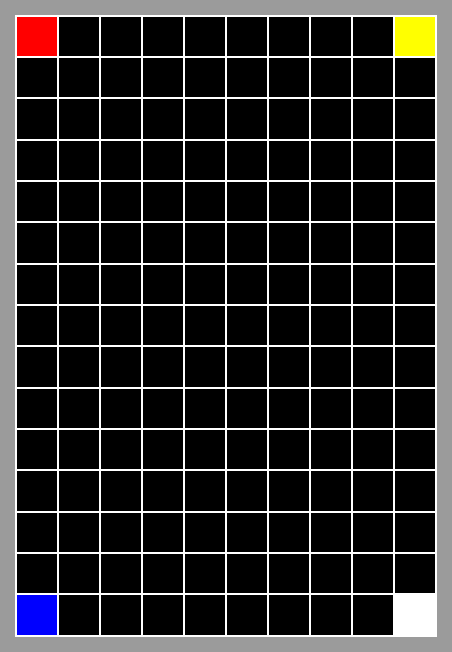

**🔙 [Forrige](guide/01-drawTestris.md) • [📜 Oversikt](sem1-tetris/..) • [🔜 Neste](guide/03-tegnbrikke.md)**


# **✅ Testing av `TetrisBoard`**  

Er programmet vårt feilfritt hvis vi kjører det og alt ser riktig ut? **Nei!** 🚨  

Det kan fungere greit helt i starten, men etter hvert som vi legger til mer kompleksitet, blir det vanskelig å sjekke alt manuelt. **Vi trenger tester.**  

---

## **🛠️ TODO – `prettyString`**  

Som vi lærte i **Lab 5**, er det sjeldent vi skriver unit-tester for grafikk. I stedet skal vi lage en metode som kan gi oss en **tekstlig representasjon** av brettet, slik at vi enkelt kan verifisere innholdet uten å måtte tolke grafikken.  

### **📌 Implementer `prettyString` i `TetrisBoard`**  

Legg til denne metoden i `TetrisBoard`:  

```java
/**
 * A string representation of the board in a readable format.
 * For testing purposes.
 *
 * @return a string representation of the board
 */
public String prettyString() {
  ...
}
```  

### **🔍 Hvordan skal `prettyString` fungere?**  

Brettet vi tegnet i forrige steg ser slik ut i GUI-en:  

  

Men i `prettyString` forenkler vi dette ved å **hente ut kun de aktuelle karakterene** fra `Grid`, slik at det ser slik ut i tekstformat:  

```
r--------y
----------
----------
----------
----------
----------
----------
----------
----------
----------
----------
----------
----------
----------
b--------w
```  

---

## **🛠️ TODO – Test `prettyString`**  

Vi skal bruke denne metoden en del gjennom resten av utviklingen for å teste forskjellige metoder.  

### **📌 Opprett `TetrisBoardTest` og legg til denne testen:**  

```java
@Test
public void prettyStringTest() {
  TetrisBoard board = new TetrisBoard(3, 4);
  ...
  String expected = String.join("\n", new String[] {
      "r--y",
      "----",
      "b--w"
  });
  assertEquals(expected, board.prettyString());
}
```  
Bytt ut `...` med linjer som får testen til å passere.

---

## **✅ Fullført?**  

Du kan gå videre når:  
✔️ `prettyString` fungerer og returnerer riktig tekstformat  
✔️ `prettyStringTest` passerer uten feil  

**🔙 [Forrige](guide/01-drawTestris.md) • [📜 Oversikt](sem1-tetris/..) • [🔜 Neste](guide/03-tegnbrikke.md)**
