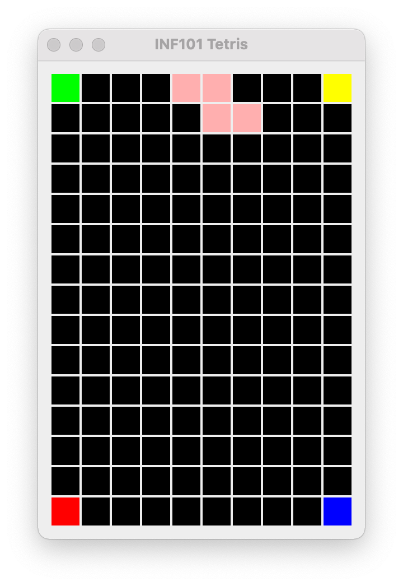
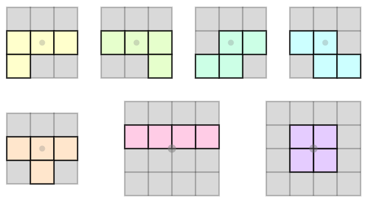

**🔙 [Forrige](guide/02-testBoard.md) • [📜 Oversikt](sem1-tetris/..) • [🔜 Neste](guide/04-flyttebrikke.md)**


# 3 🎨 Tegne brikken

Etter dette kapittelet skal du kunne kjøre programmet og se en *tetromino* øverst på brettet. 🎮

[](./pics/drawBoardWithPiece.png)

I Tetris finnes det 7 ulike typer tetrominoer:



Disse kalles (fra øverst til venstre) L, J, S, Z, T, I og O. 🔵🟣🟢🟡🔴🟠

For å kunne tegne en tetromino på brettet må vi først lage en modell som representerer en fallende tetromino.

## 🏗️ Modellering av en Tetromino

Vi starter med å opprette en pakke _no.uib.inf101.tetris.model.**tetromino**_. Her lager vi følgende:
- 🏭 Et grensesnitt `TetrominoFactory`
- 🧩 En klasse `Tetromino`
- 🎲 En klasse `RandomTetrominoFactory`

### 🧱 Klassen Tetromino
`Tetromino`-klassen representerer en tetromino i spillet. En tetromino har tre viktige egenskaper:
1. **🔠 Symbol** - Et tegn som representerer typen tetromino (f.eks. 'T', 'I', 'S'). Dette bestemmer hvilken farge brikken skal tegnes med.
2. **📐 Fasong** - Brikken kan ha ulike orienteringer, f.eks. stående eller liggende.
3. **📍 Posisjon** - Hvor på brettet brikken befinner seg.

Internt representerer vi fasongen som en todimensjonal liste av *boolean*-verdier. For eksempel kan en stående T-brikke se slik ut:

```java
new boolean[][] {
    { false, false, false },
    {  true,  true,  true },
    { false,  true, false }
}
```

#### 🔨 Konstruksjon av Tetromino-objekter

For å lage en `Tetromino`-klasse:
1. **Lag en privat konstruktør** som tar inn:
   - Et `char`-symbol
   - En `boolean[][]`-matrise for fasongen
   - En `CellPosition` for posisjonen
2. **Opprett en statisk metode `newTetromino`** som returnerer et nytt Tetromino-objekt basert på et gitt symbol.
   - Pass på at fasongen er en av de 7 typene vist i illustrasjonen.
   - Posisjonen skal være (0, 0).
   - Hvis et ukjent symbol gis, kast en `IllegalArgumentException`. ⚠️

> **💡 Tips:** Representer alle brikkene med en *kvadratisk* 2D-matrise og sørg for at alle starter med en tom rad øverst.

#### 🚀 Flytting av Tetromino-objekter

For å flytte en tetromino må vi lage en kopi med en ny posisjon:
- **Lag en metode `shiftedBy(int deltaRow, int deltaCol)`** som returnerer en ny tetromino flyttet med de gitte verdiene.
- **Lag en metode `shiftedToTopCenterOf(GridDimension grid)`** som sentrerer brikken i toppen av et gitt rutenett.

#### 🔄 Tetromino skal være iterable

For å iterere over posisjonene en tetromino dekker:
- La `Tetromino` implementere `Iterable<GridCell>`.
- Implementer `iterator`-metoden slik at den kun returnerer celler som er en del av brikken.

> **💡 Tips:** Bruk en liste til å lagre `GridCell`-objektene og en dobbel `for`-løkke for å fylle den.

#### ⚖️ Sammenligning av Tetromino-objekter

For å kunne sammenligne tetrominoer, implementer:
- `equals` ved å bruke `Arrays.deepEquals` for fasongen
- `hashCode` ved å bruke `Objects.hash()` og `Arrays.deepHashCode()`

### ✅ Testing av Tetromino

For å sikre at `Tetromino` fungerer som forventet:
- 🧪 Opprett `TestTetromino` i pakken `no.uib.inf101.tetris.model.tetromino`.
- 🔬 Skriv tester for `hashCode` og `equals`.
- 🔄 Skriv en test for `iterator`-metoden.
- 🎯 Test at flytting fungerer korrekt.

## 🏭 Fabrikker for Tetrominoer

### ⚙️ TetrominoFactory
Lag et grensesnitt `TetrominoFactory` som definerer metoden `getNext()` for å hente en ny Tetromino.

### 🎲 RandomTetrominoFactory
Lag en klasse `RandomTetrominoFactory` som implementerer `TetrominoFactory`.
- `getNext()` skal velge et tilfeldig symbol fra `"LJSZTIO"` og returnere en ny Tetromino.

## 🔗 Integrasjon i TetrisModel

I `TetrisModel`:
- ➕ Legg til en instansvariabel for `TetrominoFactory`.
- ➕ Opprett en instansvariabel for en fallende tetromino.
- 🔄 Initialiser tetrominoen ved å kalle `getNext()` og `shiftedToTopCenterOf()`.

I `TetrisMain`:
- 🏗️ Opprett en `TetrominoFactory` og bruk den når du lager et `TetrisModel`-objekt.

## 🎨 Visning av Tetrominoer

For at `TetrisView` skal tegne den fallende brikken:
- 🖼️ Legg til en metode i `ViewableTetrisModel` som returnerer cellene til tetrominoen.
- 🖌️ Endre `drawGame` i `TetrisView` slik at den fallende brikken tegnes over brettet.

> **🎉 Når du er ferdig:** Kjør programmet! Du skal nå se en fallende tetromino (selv om den ennå ikke beveger seg). 🎈

## 🧪 Testing av TetrisModel

Før vi tester `TetrisModel`, lager vi en ny fabrikk for testformål:

### 🔄 PatternedTetrominoFactory
I test-hierarkiet, lag klassen `PatternedTetrominoFactory` som implementerer `TetrominoFactory`.
- 🏗️ La konstruktøren ta inn en streng med tetromino-symboler.
- 🔁 `getNext()` skal returnere neste tetromino i rekken, og starte på nytt når listen er brukt opp.

📌 **Skriv tester i `TestPatternedTetrominoFactory`** for å sjekke at fabrikkens rekkefølge stemmer.

---

🚀 Når du er ferdig med dette steget, skal du ha en fungerende modell for å representere og tegne tetrominoer! 🎮


## **✅ Fullført?**

Du kan gå videre når:

✔️ `Tetromino`-klassen er opprettet og inneholder alle syv brikker

✔️ `drawTetromino` fungerer og tegner Tetrominoer på brettet

✔️ Du har skrevet tester for `Tetromino`-klassen ved bruk av `PatternedTetrominoFactory`

**NB: Vi kommer til å sjekke at koden fungerer, at den er designet på en god måte og er godt testet. Du må gjøre hvert av disse stegene for å få poeng.**

**🔙 [Forrige](guide/02-testBoard.md) • [📜 Oversikt](sem1-tetris/..) • [🔜 Neste](guide/04-flyttebrikke.md)**