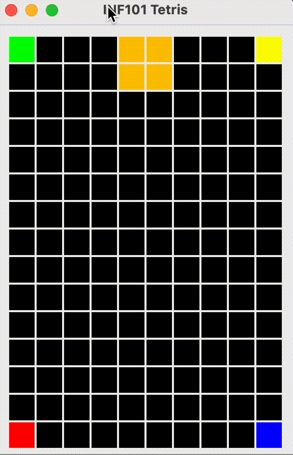

**🔙 [Forrige](guide/03-tegnbrikke.md) • [📜 Oversikt](sem1-tetris/..) • [🔜 Neste](guide/05-roterebrikke.md)**

# 4 🚀 Flytte brikken

Når du er ferdig med dette steget, kan du flytte brikken med piltastene ⬇️ på brettet.

[](./pics/movePiece.gif)

I dette steget skal vi opprette en kontrollklasse for spillet vårt. I pakken *no.uib.inf101.tetris.controller* oppretter vi:
- en klasse `TetrisController`, og
- et grensesnitt `ControllableTetrisModel`.

Vi definerer i `ControllableTetrisModel` en metode `moveTetromino(int deltaRow, int deltaCol)` som skal kunne brukes for å flytte brikken rundt på brettet. Metoden skal returnere en boolean som forteller om flyttingen faktisk ble gjennomført eller ikke. ✅

## Modellen 🏗️

La `TetrisModel` implementere grensesnittet `ControllableTetrisModel`.

Når vi skal implementere `moveTetromino`, bruker vi følgende strategi:
- I `moveTetromino` benytter vi *shiftedBy* -metoden på den nåværende fallende brikken for å få en flyttet kopi som er en *kandidat* for å bli vår neste fallende brikke.
- Vi oppretter en hjelpemetode som sjekker om en gitt Tetromino har en lovlig plass på brettet: det vil si, hvis hele brikken befinner seg innenfor brettets rammer, og ingen av rutene den okkuperer allerede er fargelagt av en flis på brettet, er posisjonen lovlig. 🟩
- Dersom kandidaten er lovlig, så oppdateres modellen, og `moveTetromino` returnerer `true`. 👍

## Kontrolleren 🎮

Opprett en klasse `TetrisController` hvor konstruktøren har parametre for både `ControllableTetrisModel`, og et `TetrisView`. Vi lagrer dem som feltvariabler. 

For å kunne ta imot tastetrykk fra brukeren, trenger `TetrisController` å gjøre to ting:
- Klassen må implementere grensesnittet `java.awt.event.KeyListener`, og
- objektet av typen `TetrisController` må bli "installert" slik at det lytter til tastetrykk når et gitt vindu har "fokus." 🎯

Siden `TetrisView` er en utvidelse av `JComponent`, representerer et `TetrisView`-objekt et visuelt element som kan få fokus og motta tastetrykk. For å installere `TetrisController`-objektet som mottaker av tastetrykk når et `TetrisView`-objekt "tetrisView" er i fokus, legger vi til følgende linje på slutten av konstruktøren til `TetrisController`:
```java
tetrisView.addKeyListener(this);
```
> ⚠️ Merk: Det er viktig at det er gjort et kall til `.setFocusable(true)` på `TetrisView`-objektet, ellers vil det ikke registrere tastetrykk selv om en KeyListener er installert. 
>
> ```java
> tetrisView.setFocusable(true);
> ```

Vi er nå klare til å håndtere tastetrykk! 🎉 Fordi `TetrisController` implementerer `KeyListener`, må vi ha metodene `keyTyped`, `keyPressed` og `keyReleased`. Vi lar metodene for `keyTyped` og `keyReleased` stå tomme, mens vi fokuserer på `keyPressed`:

Parameteren til `keyPressed` har typen `KeyEvent`. Objekter av denne typen har en metode `getKeyCode()` som returnerer hvilken tast som ble trykket. Selv om returverdien er en `int` som ikke sier oss så mye i seg selv, har klassen `KeyEvent` heldigvis mange konstanter som er mer beskrivende. For eksempel, hvis *e* er en variabel av typen `KeyEvent`, kan vi sjekke hvilken tast som ble trykket slik:
```java
if (e.getKeyCode() == KeyEvent.VK_LEFT) {
    // Venstre piltast ble trykket
}
else if (e.getKeyCode() == KeyEvent.VK_RIGHT) {
    // Høyre piltast ble trykket
}
else if (e.getKeyCode() == KeyEvent.VK_DOWN) {
    // Ned piltast ble trykket
}
else if (e.getKeyCode() == KeyEvent.VK_UP) {
    // Opp piltast ble trykket
}
else if (e.getKeyCode() == KeyEvent.VK_SPACE) {
    // Mellemromstasten ble trykket
}
```

Fyll inn passende handlinger i `keyPressed` slik at brikken beveger seg. 🕹️

### Knyt det sammen 🔗

For å faktisk kunne bruke tastetrykk må du opprette et `TetrisController`-objekt som knyttes til visningen og modellen. Dette er lurt å gjøre i `Main`, hvor du også opprettet `TetrisView` og `TetrisModel`. Derfra kan du enkelt gi dem som argumenter til `TetrisController`-konstruktøren.

Du kan nå kjøre programmet, og du skal kunne trykke på piltastene for å flytte brikken ⬇️ — men du vil ikke kunne **se** endringen med mindre du for eksempel endrer vindustørrelsen mellom hver gang du trykker. Dette er fordi visningen ikke vet at den må tegne på nytt uten at det får beskjed.

For å gi beskjed til visningen at modellen har endret seg, gjør vi et kall til `repaint` (merk: *ikke* direkte til `paintComponent`) på `TetrisView`-objektet helt på slutten av `keyPressed`-metoden.

> ⚠️ Forskjellen på å kalle *paintComponent* og å kalle *repaint* handler om hvilken "tråd" som gjennomfører tegningen. Når det gjøres et kall til `keyPressed`, skjer dette i en annen tråd parallelt med tråden som har ansvar for visningen. Dersom `paintComponent` kalles direkte fra `keyPressed`, kan det derfor skje at to tråder prøver å tegne visningen samtidig, noe som kan gi mye krøll. Det eneste som skjer i *repaint* er at det legges inn en bestilling til visningstråden om å gjøre et kall til *paintComponent*. I praksis går det bare millisekunder før *paintComponent* da blir kalt (men mye kan jo skje på et millisekund i en datamaskin). 🖥️

### Testing 🧪

* Skriv en eller flere metoder i `TetrisModelTest` som tester *moveTetromino*-metoden. Det er mange potensielle ting å teste:
    - Vellykket flytting returnerer `true` ✅
    - Vellykket flytting endrer hva man får om man iterererer gjennom den fallende brikken
    - Det er ikke mulig å flytte en brikke ut av brettet (returnerer `false` og ingen endring i den fallende brikken sin posisjon) ❌
    - Det er ikke mulig å flytte brikken et sted som er opptatt på brettet (returnerer `false` og ingen endring i den fallende brikken) ❌

---

:white_check_mark: Du kan gå videre til neste steg når du kan flytte brikken med piltastene nedover brettet. Pass på at du ikke kan flytte deg ut av brettet eller plassere deg "over" et av hjørnene vi har fargelagt, og at det heller ikke krasjer når du forsøker. 💪

--- 
**🔙 [Forrige](guide/03-tegnbrikke.md) • [📜 Oversikt](sem1-tetris/..) • [🔜 Neste](guide/05-roterebrikke.md)**
