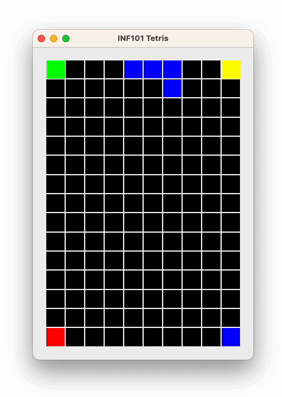

**🔙 [Forrige](guide/05-roterebrikke.md) • [📜 Oversikt](sem1-tetris/..) • [🔜 Neste](guide/07-fjernefullerekker.md)**

# 6 Droppe brikken og håndtere Game Over 🎮

Når du er ferdig med dette steget, kan du droppe brikker ved å trykke på mellomromstasten. Game Over vil vises når du har tapt. 😢

## Droppe brikken

1. Definer en metode for å droppe brikken i `ControllableTetrisModel`. 🛠️
2. Kall på denne metoden i `TetrisController` når brukeren trykker på mellomromstasten. ⏳
3. Implementer metoden i `TetrisModel`. Til dette formålet bruker vi noen hjelpemetoder:
    - En hjelpemetode for å hente en ny fallende tetromino. I første omgang henter vi en ny brikke fra tetromino-fabrikken og oppdaterer feltvariabelen for fallende brikke i modellen.
    
    - En hjelpemetode for å lime fast den fallende tetrominoen til brettet. Her itererer du over koordinatene til tetrominoen og oppdaterer verdiene på brettet i disse posisjonene. Til slutt, kall på metoden som henter en ny brikke.

    - Selve metoden som dropper en brikke. Her flytter du brikken ett steg nedover i en løkke (har vi en hjelpe-metode vi kan bruke?) så lenge det er mulig. Når det ikke lenger er mulig å flytte brikken nedover, limer vi den fast til brettet og henter en ny fallende brikke.
4. Skriv en test i `TetrisModelTest` som tester dropping av brikke. ✅

## Håndtere Game Over

Når spillet er game over, skal vi vise en "Game over"-skjerm i visningen, og tastene skal ikke kunne flytte på brikkene mer. For at visningen og kontrolleren skal kunne tilpasse oppførselen sin, må vi ha en tilstandsvariabel i modellen som forteller om vi er i game over-tilstand. 

- Opprett en enum `GameState` i *no.uib.inf101.tetris.model* som har tilstandene ACTIVE_GAME og GAME_OVER. Vi kan enkelt legge til f.eks. WELCOME_SCREEN senere om vi ønsker. 🆕
- La både `ViewableTetrisModel` og `ControllableTetrisModel` ha en metode `getGameState` som returnerer et objekt av typen GameState. 
- La `TetrisModel` ha en feltvariabel av typen GameState. I første omgang kan vi initiere den til GameState.ACTIVE_GAME. Metoden `getGameState` skal returnere denne variabelen.

Spillet er over når det ikke er plass til å hente en ny fallende brikke.
- I metoden som henter ut en ny fallende brikke: sjekk om brikken vi nettopp hentet er plassert lovlig på brettet. Hvis den ikke er lovlig, sett feltvariabelen til GAME_OVER.

### Visningen

Dersom spillet er game over, kan vi tegne en rute med gjennomsiktig farge (f.eks. `new Color(0, 0, 0, 128);`) som dekker hele skjermen, og oppå der skrive "Game Over". Her kan du bruke noe i `ColorTheme`. 🖌️

### Kontrolleren

Dersom spillet er game over, skal det ikke skje noe ved tastetrykk. 🚫

---

:white_check_mark: Du er ferdig med dette kapittelet når du kan droppe brikker med mellomromstasten, og "Game Over" vises når brettet er så fullt at en ny brikke ikke får plass. 🎉

**🔙 [Forrige](guide/05-roterebrikke.md) • [📜 Oversikt](sem1-tetris/..) • [🔜 Neste](guide/07-fjernefullerekker.md)**
