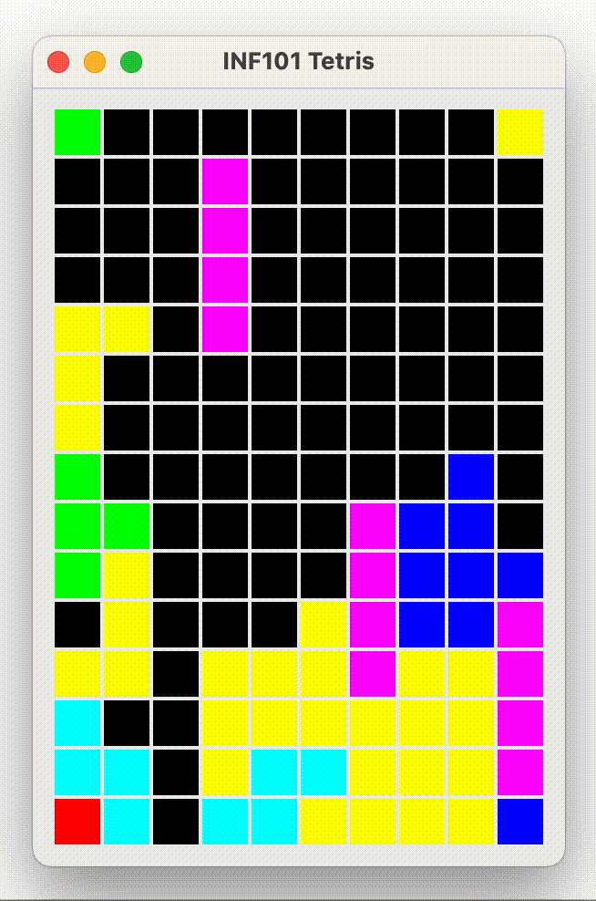

**🔙 [Forrige](guide/06-droppebrikke.md) • [📜 Oversikt](sem1-tetris/..) • [🔜 Neste](guide/08-timer.md)**

# 7 Fjern fulle rekker 🧩

Når du har fullført dette steget, vil rader bli fjernet når en brikke droppes og fyller en rekke. 🚀

[](./pics/clearRows.gif)

## Hovedmetode for fjerning av rekker

Det meste av arbeidet vil foregå i klassen `TetrisBoard`.

> **Merk:** Det kan være fristende å se på implementasjonsdetaljene i Grid og forsøke å trikse til operasjonen ved å kopiere hele rader om gangen. Dette kan virke effektivt, men kan også føre til alvorlige feil der den samme raden opptrer flere steder samtidig. Den tryggeste metoden er å gjøre dette på en "dum" måte, ved å kopiere element for element i en for-løkke. 🚫

Du kan løse dette problemet på hvilken som helst måte, så lenge du fjerner radene riktig. Her er et forslag til hvordan dette kan gjøres.

### 🛠️ Forslag til hvordan du kan fjerne rader

For å fjerne fylte rader ønsker vi å opprette en metode kalt `clearFilledRows` i `TetrisBoard`. I tillegg vil vi lage flere hjelpemetoder som skal brukes i `clearFilledRows`.

> **Hjelpemetoder** gir oss mulighet til å modulere koden. I stedet for å skrive én lang metode med mange linjer, kan vi lage flere mindre metoder, hver med en klar og veldefinert rolle.

1. **Metode: `clearFilledRows`**
   - **Formål**: Denne metoden fungerer som hovedinngangspunktet for å fjerne fylte rader. Den kaller andre hjelpemetoder for å utføre spesifikke oppgaver.
   - **Beskrivelse**: Metoden setter en teller for antall fjernede rader og går gjennom radene fra bunnen og oppover. Hvis en rad er fylt, kalles en metode for å fjerne den, og telleren økes.

2. **Metode: `isRowFilled(int row)`**
   - **Formål**: Denne metoden sjekker om en spesifisert rad er helt fylt. Den itererer gjennom hver celle i raden for å bekrefte at det ikke finnes tomme plasser.
   - **Beskrivelse**: Metoden går gjennom hver celle i raden, og hvis en celle er tom, returnerer den `false`. Hvis alle cellene er fylt, returneres `true`.

3. **Metode: `removeRow(int row)`**
   - **Formål**: Denne metoden fjerner en spesifisert fylt rad ved å forskyve alle radene over den ned med én posisjon. Den kopierer innholdet fra hver ikke-fylt rad til raden rett under den fylte raden.
   - **Beskrivelse**: Metoden går gjennom radene som ligger over den fylte raden og kopierer innholdet nedover. Etter at raden er fjernet, fylles den nyopprettede tomme raden på toppen med plassholdere.

4. **Metode: `copyRowTo(int originalRow, int targetRow)`**
   - **Formål**: Denne metoden kopierer innholdet fra en rad til en annen. Den sikrer at verdiene overføres nøyaktig.
   - **Beskrivelse**: Metoden går gjennom hver celle i kilderaden og setter verdiene i målradens celler til å være lik kilderadens celler.

5. **Metode: `fillTopRowWithEmpty(int row)`**
   - **Formål**: Denne metoden setter alle celler i den spesifiserte raden til plassholderkarakteren (som indikerer tomhet). Den kalles når en rad er fjernet og trenger å fylles med tomme celler.
   - **Beskrivelse**: Metoden går gjennom hver celle i raden og setter cellens verdi til en plassholderkarakter som representerer tomhet.

*Pass på at du ikke prøver å gjøre noe med en rad som ikke er på brettet, da kan du få `IndexOutOfBoundsException` eller noe tilsvarende.* ⚠️

### 🛠️ Sammenkobling av metoder

Når disse metodene er definert, kan `clearFilledRows` orchestrere hele prosessen med å identifisere og fjerne fylte rader på en effektiv måte. Hver hjelpemetode har et klart ansvar, noe som gjør koden enklere å lese og feilsøke.

- **Flyt av utførelse**:
  1. `clearFilledRows` kalles for å starte prosessen med å fjerne rader.
  2. Den går gjennom hver rad fra bunnen og oppover, og sjekker om hver rad er fylt ved hjelp av `isRowFilled`.
  3. Når en fylt rad oppdages, kalles `removeRow` for å håndtere forskyvningen av radene og fyllingen av toppen.
  4. Metoden `copyRowTo` brukes for å flytte rader nedover, og sikrer at ingen data går tapt.
  5. Til slutt fyller `fillTopRowWithEmpty` den nyopprettede tomme raden med plassholderkarakteren.

Ved å strukturere implementeringen på denne måten, skaper du en klar og vedlikeholdbar kodebase som nøyaktig gjenspeiler spillmekanikkene i Tetris, samtidig som det åpner for fremtidige modifikasjoner eller forbedringer.

## 🧪 Testing

Fjerning av rekker er spesielt viktig å teste grundig med automatiserte tester, ettersom dette tar tid å teste manuelt. 🧪

*Legg til følgende test i `TestTetrisBoard`:*

```java
@Test
public void testRemoveFullRows() {
  // Tester at fulle rader fjernes i brettet:
  // -T
  // TT
  // LT
  // L-
  // LL

  TetrisBoard board = new TetrisBoard(5, 2);
  board.set(new CellPosition(0, 1), 'T');
  board.set(new CellPosition(1, 0), 'T');
  board.set(new CellPosition(1, 1), 'T');
  board.set(new CellPosition(2, 1), 'T');
  board.set(new CellPosition(4, 0), 'L');
  board.set(new CellPosition(4, 1), 'L');
  board.set(new CellPosition(3, 0), 'L');
  board.set(new CellPosition(2, 0), 'L');

  assertEquals(3, board.removeFullRows());

  String expected = String.join("\n", new String[] {
    "--",
    "--",
    "--",
    "-T",
    "L-"
  });
  assertEquals(expected, board.prettyString());
}
```

*Du kan også skrive dine egne tester for fjerning av rekker:*
- En test der nederste rad må beholdes.
- En test der øverste rad skal fjernes.
- En test med en annen bredde på brettet.

Det kan være lurt å opprette en hjelpemetode `getTetrisBoardWithContents` som kan omgjøre en `String[]` til et `TetrisBoard`. Dette gjør testene lettere å lese, og reduserer risikoen for feil i testene.

*Testen kan se slik ut:*

```java
@Test
public void testRemoveFullRows() {
  TetrisBoard board = getTetrisBoardWithContents(new String[] {
    "-T",
    "TT",
    "LT",
    "L-",
    "LL"
  });
  assertEquals(3, board.removeFullRows());
  String expected = String.join("\n", new String[] {
    "--",
    "--",
    "--",
    "-T",
    "L-"
  });
  assertEquals(expected, board.prettyString());
}
```

---

## Knyt det sammen

I `TetrisModel`, gjør et kall på metoden din i `TetrisBoard` som fjerner fulle rader like etter at du har limt den fallende brikken til brettet, men før du har hentet en ny fallende brikke. Returverdien er antall rekker som ble fjernet, og du kan gjerne bruke den til å beregne en løpende poengsum. 🏆

---

:white_check_mark: Du er ferdig når rekker blir fjernet fra brettet når de blir fylt. Sjekk at det også fungerer når du får flere fulle rekker på brettet, og at det fungerer på nederste rad. 🎉

**🔙 [Forrige](guide/06-droppebrikke.md) • [📜 Oversikt](sem1-tetris/..) • [🔜 Neste](guide/08-timer.md)**
