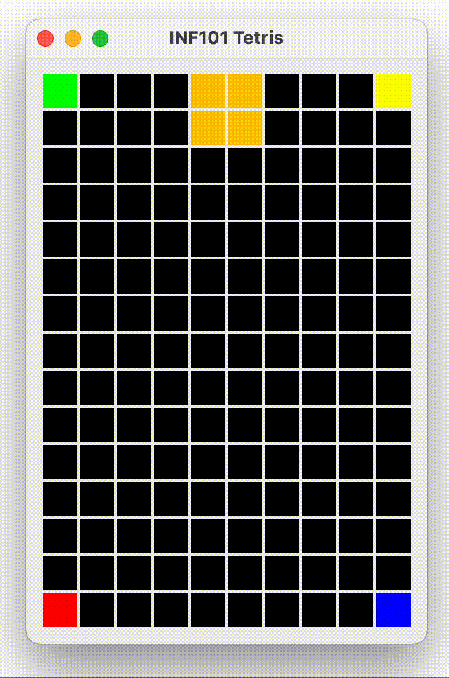

**🔙 [Forrige](guide/07-fjernefullerekker.md) • [📜 Oversikt](sem1-tetris/..) • [🔜 Neste](guide/09-ideer.md)**

# 8 Timer ⏰

Når du er ferdig med dette kapittelet, vil brikken falle av seg selv uten at brukeren trenger å trykke noe. Da er Tetris ferdig! 🎮✨

[](./pics/timer.gif)

## Modellen

Selv om timeren er en del av kontrollen, må vi først forberede modellen med den informasjonen kontrollen trenger. 🛠️
- Definer i `ControllableTetrisModel` en metode som henter ut hvor mange millisekunder (som integer) det skal være mellom hvert klokkeslag (f. eks. vil en returverdi på 1000 bety 1 sekund mellom hver gang tetrominoen faller). ⏱️
- I `TetrisModel`, implementer overnevnte metode. For nå kan du alltid returnere 1000 (denne metoden kan endres dersom du velger å gjøre bonusoppgaven med å ha økende vanskelighetsgrad i spillet). 📈
- Definer i `ControllableTetrisModel` en metode `clockTick` som kalles hver gang klokken slår. 
- Implementer `clockTick`-metoden i `TetrisModel`:
    - Flytt den fallende brikken en rad nedover. Dersom den ikke fikk lov til å flytte seg (sjekk returverdien!), lim den fast i stedet. 🏋️‍♂️
- Skriv en test for `clockTick`-metoden i `TetrisModelTest`. 🧪

## Kontrollen 

Nå til selve timeren! Vi skal bruke en timer fra swing-rammeverket, og tanken er å håndtere klokkeslagene som kommer fra timeren i klassen `TetrisController`. For å gjøre dette må TetrisController ha en metode med en parameter av typen *ActionEvent* (importeres fra *java.awt.event*). 🎉

- Opprett en metode `clockTick` med en parameter av typen *ActionEvent*.
- Opprett en instansvariabel av typen *Timer* (importeres fra *javax.swing* — pass på, den skal *ikke* importeres fra java.utils) og initialiser den i konstruktøren til *TetrisController*. Konstruktøren til Timer tar to argumenter: 
    * *hvor ofte* den skal gjøre noe (en int med antall millisekunder), og
    * *hva* den skal gjøre (en metode med ActionEvent-parameter).
    
For eksempel:
```java
this.timer = new Timer(model.getTimerDelay(), this::clockTick);
```

- For å starte timeren må `start`-metoden til timeren kalles. Dette kan du gjøre på slutten av konstruktøren til TetrisController. 🚀
- Opprett en hjelpemetode i TetrisController som henter ut riktig delay fra modellen, og kaller både `setDelay` og `setInitialDelay` på timer-objektet med den nye verdien. ⏲️
- I metoden `clockTick` gjør vi følgende:
    - Hvis spillet er i aktiv tilstand (ikke game over):
        - Gjør et kall til `clockTick` på modellen.
        - Gjør et kall til hjelpemetoden vår som oppdaterer delay for timeren (dette er egentlig bare nødvendig hvis du gjør bonusoppgaven med å ha flere nivåer). 🔄
        - Gjør et kall til `repaint` på visningen. 🎨

For å gjøre opplevelsen av nedover-trykking og dropping litt smudere, legg gjerne inn et kall til `restart` på timeren etter at brukeren har trykket pil-ned og space. For pil-ned-trykket, gjør bare kallet til reset dersom brikken faktisk flyttet seg. Da unngår vi at brikken aldri limer seg fast når brukeren trykker på pil ned kjempefort. ⚡

## Ferdigstill

Fjern koden som fargelegger hjørnene. ❌

:white_check_mark: Du er ferdig dersom brikken faller periodisk nedover etter hvert som du får nye brikker, og du kan spille Tetris uten bugs! 🎊

## Legg til musikk 🎶
I `TetrisController`, opprett en feltvariabel av typen `TetrisSong` initiert med et nytt objekt. På slutten av konstruktøren, gjør et kall til `run` på objektet. 🎵

---

# :boom: Du er ferdig med det funksjonelle! 
Gratulerer du har laget ferdig Tetris fra scratch etter bare å ha programmert i ca. 6 måneder. Bruk denne oppgaven til å imponere venner og familie! :)

Selv om programmet fungerer så kan det gjøres bedre! Har du god kodestil? Har du skrevet nok tester? Du sjekke coverage med:
```sh
mvn test-compile org.pitest:pitest-maven:mutationCoverage
```

:white_check_mark: Sørg for å svare på spørsmålene i [svar.md](../svar.md). **SVARENE DINE KAN GI HELE 3 POENG!**

# 🤔 Bonuspoeng?
Har du overskudd, er ivrig og ønsker å få bonuspoeng? Du kan utvide Tetris-programmet med hva du vil! Det vi synes er imponerende vil få bonuspoeng.

De aller beste innleveringene vil vises frem på forelesning og motta diplom for enorm innsats 🏆

**🔙 [Forrige](guide/07-fjernefullerekker.md) • [📜 Oversikt](sem1-tetris/..) • [🔜 Neste](guide/09-ideer.md)**
